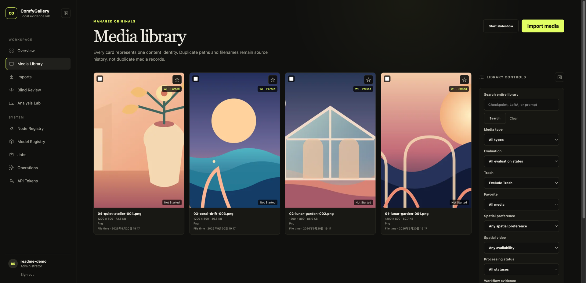
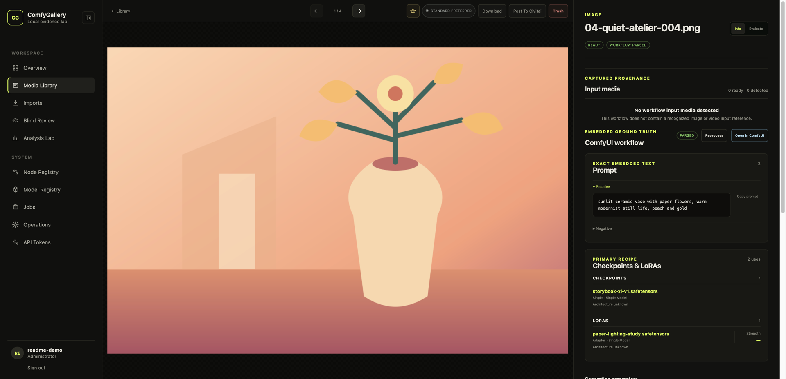
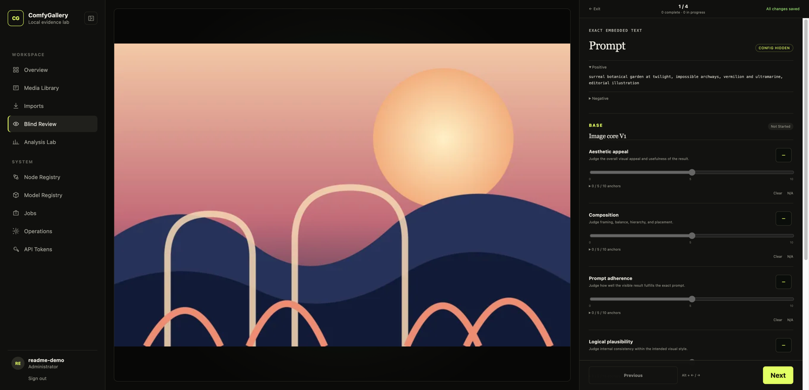
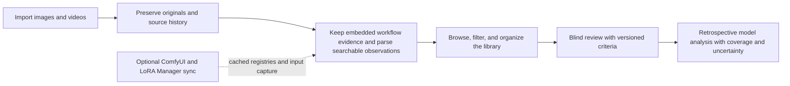

# Project Comfy Gallery

**A self-hosted home for ComfyUI generations, with the workflow evidence and review history kept alongside each image or video.**

Bring in outputs by upload or from a read-only local/NAS folder. Browse and group
them, recover the prompts and model usage embedded in their files, review them
without seeing generation settings, then explore how selected checkpoints and
LoRAs performed in the media you reviewed.

The project is designed for a single user and runs on your own machine or NAS.
Its governing product and engineering documentation starts at
[doc/README.md](doc/README.md).

## See it in use

The screenshots below use synthetic artwork and workflow metadata created for
this README. They contain no media from a personal library.

### Browse and filter a shared library

Search prompts and model names, narrow the gallery by workflow and evaluation
state, and use collections, tags, or saved filters to bring related work
together.



### Inspect an image with its ComfyUI evidence

The media record keeps the preview close to the exact embedded prompt and the
checkpoint and LoRA observations parsed from its workflow. Raw evidence remains
available alongside the normalized view.



### Review without seeing the model configuration

Score images or videos against versioned criteria while generation settings are
hidden. Each decision saves independently, so a session can be resumed later.



## What you can do

### Find and organize related media

- Upload images and videos, or register a host directory such as a NAS output
  folder and scan it when you choose.
- Search across prompts and model names. Filter by media type, workflow state,
  evaluation progress, checkpoint, and LoRA.
- Build collections and tags, save useful filters, select matching items, and
  start a review from a chosen library scope.
- Browse cached Node and Model registries so your local inventory remains useful
  when ComfyUI is offline.

### Keep originals and workflow evidence

- Store managed originals by content hash and preserve the history of source
  paths. A read-only import mount is never modified by the application.
- Read embedded ComfyUI prompt and workflow data from supported image and video
  files. The original decoded evidence stays intact while a versioned parser
  builds a searchable view of nodes, connections, model usage, and parameters.
- Keep unfamiliar nodes and values visible as generic evidence instead of
  discarding the workflow because a node is not recognized.
- Generate thumbnails, video posters, and browser-friendly video proxies as
  separate assets; these do not replace the original.

### Evaluate at your own pace

- Use configuration-blind image and video review with a stable, versioned
  scoring template. Scores are 0–10; a real zero, N/A, and an unanswered
  criterion remain distinct.
- Autosave every decision and resume sessions later. Review can begin from a
  selection, collection, source directory, filter, saved filter, or eligible
  random pool.
- Trash is reversible and excludes an item from analysis by default. It is not
  deletion and does not mean a score of zero.

### Explore model tendencies with context

- Run retrospective checkpoint and LoRA reports after reviewing media; setting
  up a formal experiment is not required.
- Keep comparisons within the selected architecture, pipeline role, model
  group, or training series. Unknown model architecture remains browsable and
  reviewable, but is excluded from model-based comparisons until classified.
- Inspect coverage, distributions, uncertainty intervals, and the exact media
  behind a result. These reports describe associations in your library; they do
  not establish that a model caused an outcome or is universally better.

## How the pieces fit together



ComfyUI does not need to stay online for library browsing, review, or analysis.
Connect it when you want to manually sync node/model information or run the
best-effort capture job for workflow input images and videos. Cached registry
data and already captured inputs remain available offline. Optional Civitai
enrichment can add provider metadata; locally managed models remain valid when
no provider match exists.

## Quick start

You need Docker with Compose. Copy the example environment file, replace the
password placeholders, then start the stack:

```bash
cp .env.example .env
docker compose up --build
```

Open <http://localhost:8080> and sign in with `CG_ADMIN_USERNAME` and
`CG_ADMIN_PASSWORD` from `.env`.

By default, managed originals and derived assets live under `./data/media`. The
host folder `./data/import` is mounted read-only at `/imports`. Open **Imports**
to register `/imports` or one of its subdirectories, then start a scan. To use
existing NAS folders, set absolute paths in `.env`:

```dotenv
MEDIA_DATA_ROOT=/volume1/docker/comfy-gallery/media
IMPORT_ROOT=/volume1/comfyui/output
```

The application leaves `IMPORT_ROOT` untouched and copies accepted originals
into `MEDIA_DATA_ROOT`.

To enable one-click node/model synchronization, set the LAN URL of the ComfyUI
installation that hosts LoRA Manager:

```dotenv
CG_COMFYUI_BASE_URL=http://192.168.x.x:8188
```

For a multi-user ComfyUI installation, also set `CG_COMFYUI_USER`.

## Production NAS deployment

Set your NAS paths and the public origin in `.env`:

```dotenv
MEDIA_DATA_ROOT=/share/ComfyGallery/media
IMPORT_ROOT=/share/ComfyUI/output
BACKUP_ROOT=/share/ComfyGallery/backups
CG_ALLOWED_ORIGINS=http://192.168.50.68:8080
TZ=Asia/Shanghai
```

Source files must be readable by container UID 10001; the import mount remains
read-only. Start the production topology with:

```bash
make production
```

Only the web port is published. After signing in, open `/operations` to review
disk, worker, queue, and backup status. Run an immediate database backup with:

```bash
make backup
```

Database dumps protect PostgreSQL and manual work. Include `MEDIA_DATA_ROOT` and
`BACKUP_ROOT` in the NAS snapshot or off-device backup policy. Read the
[recovery runbook](doc/operations/backup-recovery-observability.md) and
[upgrade runbook](doc/operations/upgrade-runbook.md) before restoring or
upgrading.

## Local development

Mac development uses isolated local data, a separate PostgreSQL/Redis Compose
project, native FastAPI and worker processes, and Vite hot reload:

```bash
make dev
```

Open <http://127.0.0.1:5173>. On the first run, `make dev` creates the ignored
`.env.development`, installs dependencies, starts local infrastructure, applies
migrations, and creates the local administrator. It does not use the NAS
database or managed media.

See [Mac-first development and milestone releases](doc/development/mac-first-development-and-release.md)
for development commands, data isolation, GitHub-built AMD64 milestone images,
and pull-only NAS deployments.

## Current release

The locked release candidate is `0.1.0-rc.24`. Runtime images use the same tag
and OCI version label, and upstream base images are pinned by digest. This
release has been deployed and verified on the x86 J4125 NAS.

Detailed implementation and validation records:

- [Phase 1: Media ingestion](doc/development/phase-1-media-ingestion.md)
- [Phase 2: Workflow evidence](doc/development/phase-2-workflow-evidence.md)
- [Phase 3: Node and model registries](doc/development/phase-3-node-model-registries.md)
- [Phase 4: Manual evaluation](doc/development/phase-4-manual-evaluation.md)
- [Phase 5: Model-focused analytics](doc/development/phase-5-model-analytics.md)
- [Phase 6: NAS release](doc/development/phase-6-nas-release.md)

Accepted behavior is defined by stable IDs in the
[product requirements](doc/product/requirements.md). Implementation coverage
is tracked in [requirements traceability](doc/requirements-traceability.md).

## Checks

```bash
make check
make audit
make image-audit
```

`make image-audit` builds and scans the final AMD64 runtime images, so it takes
longer than the normal code test suite.
