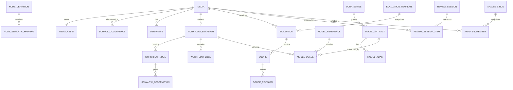

# Conceptual Data Model

**Status:** Accepted
**Purpose:** Define ownership, identity, relationships, and migration invariants. Exact SQL naming may change during implementation, but the concepts and constraints are normative.

## Entity overview

## Identity strategy

### Media

- `media.id`: UUIDv7 generated by the application.
- `media_asset.sha256`: unique hash of original file bytes.
- Original filename is not unique.
- Media type, dimensions, duration, and codecs are attributes, not identity.

Exact duplicate behavior:

- A repeated SHA-256 attaches a new source occurrence to the existing media.
- The media has one evaluation history regardless of how many sources contain it.

### Models

Model identity has graded evidence:

1. Cryptographic hash match.
2. Authoritative local registry record.
3. Unique filename/path match.
4. Workflow-reference-only identity.

Raw workflow references are always retained even when linked to a canonical artifact.

### Nodes

A node class name is insufficient because custom node definitions evolve. Definition variants are identified by:

- Node class/type.
- Python/custom-node module when known.
- Normalized schema fingerprint.

Anonymous ComfyUI schema sync batches record capture time and reported ComfyUI/package versions but do not create persistent ComfyUI-instance entities.

## Media and source entities

### `media`

Key concepts:

- UUIDv7 ID.
- Kind: image or video.
- Lifecycle/readiness status.
- Evaluation-derived state cache, if used, must remain reconstructable.
- Trash is not stored here as deletion; it belongs to evaluation disposition.

### `media_asset`

- One immutable original per media.
- SHA-256, byte size, MIME type, extension, managed relative path.
- Original storage completion timestamp.
- No update operation may replace the original bytes.

### `source_root`

- User-configured allowed import root.
- Display name and mounted path.
- Enabled flag and scan policy.
- Must not overlap managed storage.

### `source_occurrence`

- Root and normalized relative path.
- Original filename.
- Observed size and modification time.
- Last-seen scan.
- Current source status: present, changed, missing, unreadable.
- Linked media ID after successful identification.
- Historical rows remain after a source file disappears.

### `scan_batch` and per-file outcome records

- Durable manual rescan request.
- Counts by discovered, skipped, imported, duplicate, failed, and missing.
- Phase 1 uses `source_occurrence` for durable path outcomes and an `ingest_source`
  `job` for every file that requires work. A separate `scan_entry` table is not
  needed until a per-scan immutable entry log is required by the UI.

### `derivative`

- Kind: thumbnail, poster, preview, or video proxy.
- Source media and generation recipe version.
- Codec/container/dimensions/size.
- Regenerable and never authoritative.

## Workflow evidence

### `embedded_metadata`

- Media ID.
- Metadata namespace/key.
- Raw bytes or exact decoded string.
- Parse status and decoding information.
- SHA-256 of the metadata payload for integrity.

### `workflow_snapshot`

- Media ID.
- Raw API-prompt JSON when present.
- Raw visual-workflow JSON when present.
- Raw extra metadata JSON.
- Detected schema/workflow versions.
- Overall parse status.

Raw JSON is immutable. New parser versions create new extraction runs rather than updating the evidence.

Phase 2 implements one snapshot per exact media identity with:

- Reader/source-carrier identity and version.
- SHA-256 over the complete decoded carrier metadata.
- Exact API-prompt and visual-workflow strings when the carrier exposed strings.
- Independently decoded API-prompt and visual-workflow JSON.
- Independent representation states and one overall parse state.
- Structured issues plus derived graph counts/version.

For video, decoded `ffprobe` format tags retain the complete original comment wrapper;
child JSON can therefore be reparsed without recovering it from normalized graph
records.

## Generic graph

### `workflow_node`

- Snapshot and original node ID.
- Representation: API prompt or visual workflow.
- Class/type.
- Title and module hints.
- Mode/bypass flags.
- Raw properties.
- Raw widget values.
- Named API inputs when present.

### `workflow_edge`

- Snapshot.
- Representation and stable ordinal within that representation.
- Source node/output index.
- Destination node/input index or name.
- Declared datatype when known.
- Original link ID.

### `workflow_value`

Optional normalized representation for queryable values:

- Node and input identity.
- Value kind: scalar, string, JSON, link, list, missing.
- Original value.
- Normalized value where safe.
- No normalization discards the original.

## Node registry and semantic observations

### `node_definition`

- Class/type, module, schema fingerprint.
- Required/optional/hidden inputs.
- Input order, output types/names, category, description, aliases.
- Definition source: built-in pack, ComfyUI snapshot, inferred, manual.
- First and last observed timestamps.

### `node_semantic_mapping`

- Node-definition variant or compatible class pattern.
- Input name/widget locator.
- Semantic tag: checkpoint, LoRA, prompt, sampler configuration, or supported extension.
- Optional extraction transform.
- Source: built-in, inferred, manual.
- Confidence and activation state: confirmed, high-confidence active, needs-review, unknown.
- Supersession and revision history.

Manual mappings have precedence. New schema variants may inherit a mapping only after compatibility checks.

### `extraction_run`

- Extractor name/version and configuration hash.
- Input workflow snapshot and node-registry snapshot references.
- Start/end/status/error.
- Reprocessing reason.
- Current-run marker; a new successful/warning run supersedes the prior current marker
  without deleting it.

### `semantic_observation`

- Extraction run and workflow/node source.
- Observation type and typed value.
- Confidence.
- Provenance/evidence JSON.
- Optional manual override relationship.

Observations are append/version based. “Current” is a query over precedence, not destructive replacement.

## Model registry

### `model_artifact`

- UUID.
- Model type: checkpoint, diffusion model, GGUF model, LoRA, VAE, text encoder, or other.
- SHA hashes where available.
- Display name.
- Architecture family and lineage/variant.
- Precision and quantization.
- Availability state.
- Identity evidence state.
- Manual fields and provenance.

### `model_alias`

- Artifact.
- Exact filename/path alias.
- Alias source and first/last observed times.
- An alias may be ambiguous across artifacts until hash evidence resolves it.

Phase 3 stores current inventory aliases in `model_artifact.raw_inventory` and builds
the normalized full-path/basename index during resolution. A separate `model_alias`
table remains a future normalization option if alias history requires independent
queries.

### `model_reference`

- Exact raw value from a workflow.
- Inferred model type.
- Availability and historical state.
- Optional reversible link to a canonical artifact.
- Link method and confidence.

### `model_usage`

- Workflow snapshot and source node/input.
- Raw model reference.
- Optional canonical artifact.
- Pipeline pattern.
- Usage slot.
- Branch/stage/pass data.
- Strength/configuration retained as raw structured data.
- Extraction confidence and version.

### `lora_series`

- UUID and opaque series name.
- Inference rule/version.
- Manual confirmation/correction state.

Members remain model artifacts. `training_step` is an integer attribute of membership/artifact metadata, not part of the series name.

### `provider_snapshot`

- Provider/adapter name and version.
- Captured raw response.
- Retrieval timestamp.
- Status/error.
- Examples: LoRA Manager list/metadata and Civitai enrichment returned through LoRA Manager.

Phase 3 stores per-artifact provider payloads in
`model_artifact.raw_provider_metadata` and synchronization-level provenance/status in
`registry_sync_run`. A separate provider-snapshot table is not required by the MVP
query paths.

## Evaluation

Phase 4 implements this section in Alembic revision `0005_manual_evaluation`.
The concrete current-score table is named `evaluation_score`; Trash is stored on
`evaluation` and audited by `evaluation_disposition_revision`.

### `criterion`

- Stable UUID/key.
- Semantic meaning, media applicability, module, direction, and lifecycle.
- Label changes that do not alter meaning preserve identity.
- Meaning changes create a new criterion.

### `criterion_version`

- Criterion, wording, guidance, 0/5/10 anchors, and effective version.

### `evaluation_template`

- Immutable template/version.
- Media type and enabled optional modules.
- Ordered criterion-version membership.
- Required/N/A policy.

### `evaluation`

- Media, template snapshot, reviewer/user, and current disposition.
- Derived progress state.
- Created/updated/completed timestamps.
- A media may have a base evaluation plus supplemental module evaluations.

### `score`

- Evaluation and criterion membership.
- State: scored or N/A. Absence represents unset.
- Integer score 0–10 when scored.
- Optional N/A reason.
- Current revision pointer.

### `score_revision`

- Previous/current state and value.
- Change timestamp and actor.
- Optional correction note.

### `evaluation_disposition`

Trash state may be represented on evaluation or in a dedicated revisioned entity. It must preserve:

- Current Trash flag.
- Previous derived progress state.
- Timestamp/history.
- Reversible restore behavior.

## Library and review

Phase 4 implements static organization and review snapshots. The concrete collection
table is named `media_collection` to avoid confusing it with a generic SQL/container
concept.

### `collection` and `collection_item`

Static explicit media membership. No media bytes are copied.

### `tag` and `media_tag`

Manual organization and filtering.

### `saved_filter`

- Name.
- Versioned validated filter expression.
- Sort order and optional presentation settings.

### `review_session`

- Source scope description.
- Ordering mode and randomization seed when applicable.
- Applicable optional rubric modules.
- Current cursor/status.
- Created/updated timestamps.

### `review_session_item`

- Snapshotted media ID and stable order.
- Per-item visit/progress markers.
- Does not own evaluation data.

## Analytics

### `weighting_profile`

- Stable key plus immutable version.
- Criterion-key to non-negative weight map and default weight.
- Built-in Equal weight V1 or creating user.

### `analysis_run`

- Immutable UUID and report type.
- User-facing question/title.
- Validated filters.
- Grouping factor and boundaries.
- Template/criteria/profile references.
- Software/calculation version.
- Creation timestamp and parent run for reruns.
- Frozen effective criteria, warnings, counts, and interpretation context.

### `analysis_member`

- Exact media ID.
- Exact evaluation/template and evaluation version.
- Inclusion/exclusion reason, frozen group keys, and model-use context.
- Composite value and exact contributing criterion keys.

### `analysis_score_snapshot`

- Exact criterion-version and latest score-revision references used by the run.
- Stable criterion key and label.
- Scored/N/A state and raw value.
- Applied weighting-profile value.

### `analysis_result`

- Group keys.
- Counts and coverage.
- Eligible/scored/N/A/not-collected/Trash counts and coverage.
- Mean, median, range, quartiles, deterministic bootstrap interval, reference
  difference, and Cliff's delta.
- Histogram, evidence label, frozen dimensions, and co-occurrence/identity context.

## Jobs

### `job`

- Durable job ID, kind, queue, resource type/ID, status, stage, progress, attempt
  count, cancellation flag, and structured error.
- Resource links connect jobs to upload items and scan batches without making Redis
  authoritative.

### `job_stage_attempt`

- Stage name (recipe/parser versions belong to the produced derivative/observation).
- Attempt number.
- Start/end/status.
- Retryability and structured error.
- Input/output fingerprints where useful.

## Operations

### `export_run`

- Creator, export schema version, requested options, and lifecycle timestamps.
- Queued/running/succeeded/failed status with a stable error.
- Filesystem-relative artifact path, whole-bundle SHA-256, byte size, and per-table
  row counts.
- The ZIP lives on mounted storage; the relational row remains durable history.
- Passwords, sessions, and API tokens are never part of the export domain.

Worker liveness and scheduled-backup state use small atomic files under the
runtime/backup mounts because they describe external process/file state. PostgreSQL
continues to own jobs, export history, and all user data.

## Versioning and migration rules

1. Raw evidence tables are append-only.
2. Semantic extractor changes create new extraction runs.
3. Manual overrides remain addressable after reprocessing.
4. Criterion meaning changes create new identities or versions according to the evaluation design.
5. Historical missing scores are never backfilled as zero.
6. Saved analyses retain exact score revisions.
7. Migration scripts must not depend on external ComfyUI/Civitai availability.
8. Every destructive schema migration requires a tested backup/restore rehearsal.
