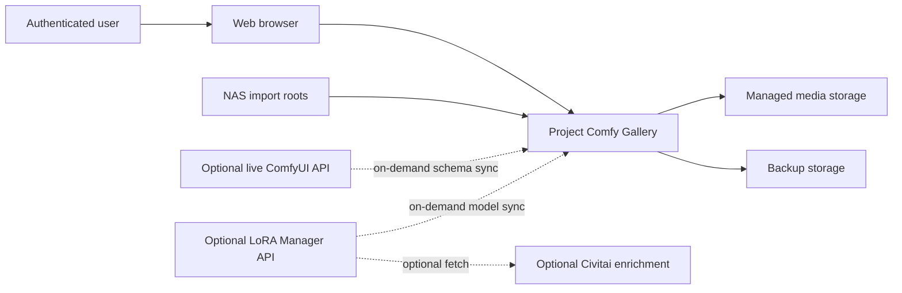
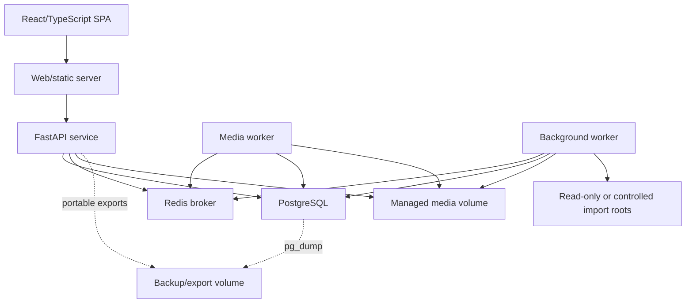
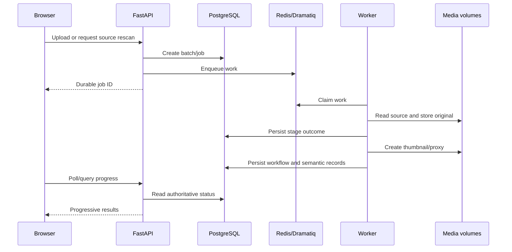

# System Architecture Overview

**Status:** Accepted

## Context

Project Comfy Gallery is a single-user, self-hosted application that turns ComfyUI media and embedded workflows into a managed library, an evaluation dataset, and an observational analysis environment.

ComfyUI and LoRA Manager are not runtime dependencies for browsing, reviewing, or analyzing already imported data.

## Runtime components

### Frontend

Responsibilities:

- Authentication and session handling.
- Library, record, import, registry, review, and analysis interfaces.
- Media preview through authenticated URLs.
- Local interaction state, server-state caching, and optimistic UI where safe.
- Virtualized rendering for large galleries.

The frontend does not parse workflows or calculate authoritative analysis results.

### FastAPI service

Responsibilities:

- Authentication, authorization, and API-token management.
- Request validation and transactional commands.
- Query/pagination APIs.
- Media range delivery and controlled original download.
- Job creation, cancellation requests, and retry requests.
- Analysis-run creation and retrieval.
- Health/readiness endpoints.

CPU-heavy file inspection, hashing, extraction, thumbnailing, and transcoding do not run in API request handlers.

### Dramatiq worker pools

Responsibilities:

- Source scanning and inventory updates.
- Hashing, media probing, original placement, and derivative creation.
- Embedded metadata extraction and workflow normalization.
- Semantic extraction and reprocessing.
- ComfyUI node-schema synchronization.
- LoRA Manager/model registry synchronization.
- Analysis computation when a report is too expensive for an API transaction.
- Scheduled backups and housekeeping when configured.

The critical pool consumes only `system` and `media` queues, so uploads and spatial
variant validation cannot wait behind a long scan or registry reprocessing run.
The background pool consumes `scan`, `workflow`, `registry`, and `maintenance`.
Each pool uses one process and one thread; their CPU and memory ceilings are
separate and explicitly bounded for the J4125 CPU.

### PostgreSQL

PostgreSQL is authoritative for:

- Users, sessions, and API tokens.
- Media identity and source inventory.
- Workflow ground truth references and normalized graph records.
- Node/model registries and semantic observations.
- Evaluation templates, scores, revisions, and Trash state.
- Review sessions, collections, filters, and tags.
- Jobs, stage attempts, analysis runs, and results.

Large media bytes and proxies do not live in PostgreSQL.

### Redis

Redis transports background messages and broker state. It is not authoritative for business data. A lost Redis instance may require jobs to be reconciled and re-enqueued from PostgreSQL, but must not lose media/evaluation state.

### Filesystem volumes

- **Managed originals:** immutable files owned by the application.
- **Derivatives:** regenerable thumbnails and video proxies.
- **Import roots:** external source paths scanned under explicit configuration.
- **Backups/exports:** database dumps and portable exports.

## Architectural layers

### Layer 1: immutable evidence

- Original media bytes.
- Original embedded metadata blocks.
- Original source filename/path and observed file facts.

### Layer 2: structural interpretation

- Normalized workflow graphs.
- Nodes, named/positional values, links, and types.
- Media probe output.

### Layer 3: semantic interpretation

- Prompt observations.
- Checkpoint/LoRA/sampler/model-usage observations.
- Pipeline patterns and usage slots.
- Model/node registry links.
- Confidence, extractor version, and manual overrides.

### Layer 4: user judgment and analysis

- Evaluation templates and raw scores.
- Composite profiles.
- Review sessions.
- Observational analysis datasets and results.

Dependencies point downward. A higher layer never rewrites a lower layer.

## Processing flow

## Failure boundaries

- ComfyUI unavailable: schema synchronization fails independently; existing cached registry remains usable.
- LoRA Manager unavailable: model synchronization fails independently; media import and review continue.
- Civitai miss/failure: enrichment is partial; local model identity remains valid.
- Redis loss: PostgreSQL job reconciliation detects unfinished work.
- Worker restart: durable stage records prevent completed work from being repeated unnecessarily.
- Derivative corruption: proxy/thumbnail can be regenerated from immutable original.
- Workflow parse failure: media becomes ready with a visible parse error rather than disappearing.
- Database loss: restore from PostgreSQL backup; source rescans alone are insufficient because evaluations are irreplaceable.

## Technology decisions

- Backend language: Python.
- HTTP framework: FastAPI.
- Python dependency/environment management: `uv`.
- Relational database: PostgreSQL with JSONB where structure is heterogeneous.
- Migrations: Alembic.
- Worker: Dramatiq.
- Broker: Redis.
- Frontend: React with TypeScript and Vite.
- Server-state queries: TanStack Query.
- Large-list rendering: virtualization.
- Media inspection/transcoding: ffprobe/ffmpeg.
- Packaging/deployment: Docker Compose.

See the ADR directory for rationale and consequences.

## Architectural invariants

1. Original bytes and embedded metadata are immutable.
2. Filenames never establish media identity.
3. Hash evidence outranks filename inference.
4. Manual semantic corrections outrank automated inference.
5. Raw evaluation values outrank composites.
6. Redis is never the sole owner of durable job state.
7. External enrichment cannot block import.
8. Unknown information is retained, not discarded.
9. Saved analyses are reproducible snapshots.
10. The ordinary application remains usable offline from ComfyUI and external providers.
