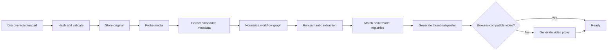

# Media Ingestion and Processing

**Status:** Accepted; Phase 1 ingestion and Phase 2 workflow-extraction stages implemented

## Goals

- Import thousands of existing files without requiring continuous user attention.
- Preserve originals before attempting optional interpretation.
- Make every stage idempotent, observable, and retryable.
- Keep the gallery progressively usable during long batches.
- Operate safely on a low-power J4125 NAS.

## Ingestion entry points

### Browser upload

- Authenticated multipart or resumable upload request.
- Multiple files per user action.
- API writes to a controlled temporary/staging area.
- API creates durable import records before worker processing.
- Upload completion enqueues processing.

Phase 1 uses authenticated multipart uploads, limited to 200 files per request and
the configured per-file byte limit. Resumable transfer is deferred until real local
network usage demonstrates a need; it must not alter media identity or pipeline
behavior.

### NAS source scan

- User registers an allowed source root mounted into the application.
- User manually triggers rescans.
- The worker traverses the configured root and updates source inventory.
- Managed storage must not be inside or overlap a source root.
- Symlink policy must be explicit and safe; the default SHOULD avoid following links outside the configured root.

### Future API ingestion

Deferred. A future ComfyUI custom node will upload/announce a media file and enqueue the same pipeline. It must not introduce a separate ingestion code path.

## Source inventory algorithm

For every root and relative path:

1. Normalize and validate the relative path.
2. Record observed size and modification time.
3. If path, size, and mtime match the previous successful observation, mark seen and skip hashing.
4. Otherwise, calculate SHA-256 as a streaming operation.
5. If SHA-256 already belongs to a media asset, link the source occurrence.
6. If new, stage and place the immutable original.
7. At scan completion, mark previously known but unseen occurrences as source-missing.

### Rename/move behavior

When a new path has an existing SHA-256:

- Link it to the existing media.
- Retain the old source occurrence as missing or historical.
- Do not duplicate evaluation or managed media.

### Changed path behavior

When an existing path produces different bytes:

- Create or link the new content identity.
- Retain the previous source occurrence history.
- Never replace the existing media asset in place.

## Managed storage

Original files are immutable after placement.

**Implemented physical layout:**

```text
managed/
  originals/<sha256-prefix>/<sha256>.<normalized-extension>
  derivatives/<media-uuid>/<recipe-version>/...
staging/
  uploads/<batch-uuid>/<item-uuid>.upload
  scans/<scan-uuid>/<item-job-uuid>.part
```

Managed and staging roots share the `/data` mount by default so final original
placement is an atomic filesystem rename. The physical layout remains an
implementation detail; database identity and references do not depend on the host
mount path.

Filesystem placement SHOULD:

- Write to staging first.
- Flush and atomically rename into the final managed path where supported.
- Verify expected size and SHA-256.
- Avoid overwriting an existing target with different bytes.

## Durable processing pipeline



Phase 1 implements discovery through probe and derivative/proxy generation. Phase 2
implements embedded evidence capture, generic graph normalization, and conservative
semantic extraction in the same durable job. Registry matching remains Phase 3.

### Stage requirements

Every stage:

- Has a stable name and implementation version.
- Records start, completion, failure, and attempt count.
- Is idempotent or protected by a transaction/unique constraint.
- Receives durable entity IDs rather than filesystem paths alone.
- Stores structured errors.
- Defines whether failure blocks readiness.

### Readiness classes

- **Processing:** original or required probe/derivative work not complete.
- **Ready:** original is safe and sufficient for library/review.
- **Ready with warnings:** optional parsing/enrichment failed.
- **Failed:** original could not be safely identified or preserved.

Workflow parsing, registry matching, and Civitai enrichment are non-blocking for media readiness. They have independent status fields.

## File validation

Validation uses content inspection rather than trusting extension:

- Detect MIME/container through a media library and/or ffprobe.
- Verify supported type.
- Reject empty or unreadable files.
- Store original extension and detected format separately.
- Calculate dimensions, frame rate, duration, stream codecs, bit depth, and color metadata when available.

Supported MVP formats:

- Images: PNG, JPEG, WebP.
- Videos: MP4, WebM.

Unknown codecs in a supported video container remain importable if ffprobe can inspect them.

## Image derivatives

- Orientation is applied correctly for display.
- Color management behavior is deterministic.
- Thumbnails are regenerable.
- Original alpha/transparency is preserved in the original.
- Thumbnail recipe/version is recorded.
- Extremely large dimensions are decoded under resource limits.

## Video derivatives

The original video remains authoritative.

If browser playback is unsupported or unreliable:

- Create a high-quality H.264 MP4 proxy.
- Generate a representative poster frame.
- Store original and proxy container/codec facts independently.
- Label the player as proxy playback.
- Keep original download accessible.

Transcoding policy:

- Default concurrency is one video transcode on J4125.
- ffmpeg subprocesses receive time and resource limits.
- Hardware acceleration through `/dev/dri` is optional and must be capability-detected.
- CPU fallback is required.
- Proxy failures leave the original preserved and the media in Ready with warnings when it can otherwise be managed.

Implemented proxy recipe `video-h264-v1` uses libx264, CRF 20, `veryfast`,
`yuv420p`, AAC audio, and `faststart`. It is versioned and may be superseded after
the private golden-video corpus is tested on the J4125.

## Bulk-capacity behavior

The target is thousands to tens of thousands of files.

Required techniques:

- Stream directory iteration; do not load all file paths into process memory.
- Commit one source item at a time so memory and rollback scope stay bounded.
- Stream SHA-256 calculation.
- One scan actor streams a source tree and processes files sequentially rather than
  enqueueing thousands of Redis messages.
- Known NAS and operating-system metadata trees are pruned before traversal,
  including QNAP `.@__thumb`, Synology `@eaDir`, recycle bins, thumbnail caches,
  AppleDouble/Spotlight data, and Windows system-volume metadata.
- Unrecognized hidden directories remain eligible source folders so intentional
  user organization is not silently discarded.
- The production worker runs one process and one thread, bounding every heavy class
  to one concurrent operation on the J4125.
- Progressive job counters and gallery visibility.
- Cancellation is cooperative at source-file boundaries; a media item already inside
  atomic placement/probe completes or fails before the request takes effect.
- Free-space checks before managed copy or transcode.

## Deduplication boundaries

MVP deduplication uses exact original-file SHA-256 only.

The following do not deduplicate:

- Similar-looking images.
- Same decoded pixels with different encoding or metadata.
- Re-encoded videos.
- Edited crops or variants.

This is deliberate. False-positive visual deduplication could discard distinct workflow evidence.

## Error model

Errors are classified by stage and retryability:

- Source disappeared during read.
- Permission denied.
- Disk full or quota exceeded.
- Hash/read failure.
- Unsupported or corrupt media.
- Original placement/verification failure.
- ffprobe failure.
- Embedded metadata absent/malformed.
- Parser/extractor failure.
- Thumbnail/proxy failure.
- External registry/API unavailable.

User-visible error records include:

- A stable error code.
- Human-readable summary.
- Stage.
- Attempt count and last timestamp.
- Retryability.
- Technical details available in an expanded view.

## Deletion and retention

The MVP has no physical purge workflow.

- Trash is an evaluation disposition, not deletion.
- Source missing does not remove managed media.
- Removing a collection/tag does not affect media.
- Derivatives may be safely regenerated, but automatic derivative cleanup policy is **Proposed** for a later operational decision.

## Security

- Import roots are administrator-configured; clients cannot submit arbitrary server paths.
- Every resolved source path must remain inside its configured root.
- Archive extraction is not part of MVP.
- Prompt/workflow metadata is untrusted data.
- Media delivery sets safe content types and avoids inline execution of arbitrary content.
- Temporary upload/staging paths are random and isolated by job UUID.
