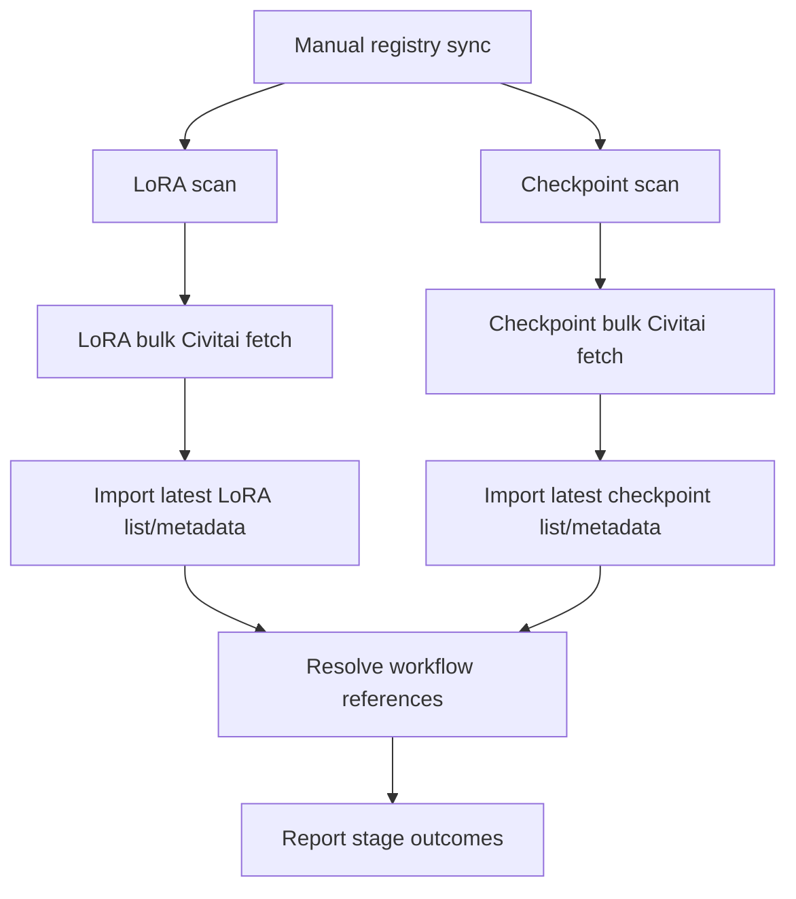

# Model Registry

**Status:** Accepted; Phase 3 core registry, synchronization, correction, and UI implemented

## Purpose

The model registry provides stable, correctable identities for checkpoints and LoRAs referenced by workflows. It must support:

- Current files known to LoRA Manager.
- Local/private models with no Civitai entry.
- Renamed aliases.
- Deleted historical models found only in workflow metadata.
- Architecture/lineage metadata.
- Model usages that vary by pipeline pattern and slot.
- Locally trained LoRA step series.

## Core distinction

The registry separates:

1. **Canonical artifact** — the model file identity.
2. **Raw model reference** — the exact filename/path embedded in a workflow.
3. **Model usage** — how that reference participates in one workflow.
4. **Provider enrichment** — optional metadata from LoRA Manager/Civitai.

No one of these replaces the others.

## Identity, availability, and enrichment

These are independent axes.

### Identity evidence

- `hash_verified`
- `registry_known`
- `filename_inferred`
- `workflow_reference_only`
- `ambiguous`

### Availability

- `present`
- `missing`
- `unknown`

### Enrichment

- `matched`
- `no_match`
- `failed`
- `not_attempted`

A locally trained LoRA can be:

```text
identity = hash_verified
availability = present
enrichment = no_match
```

This is a healthy, resolved local model.

## Canonical artifact fields

- Internal UUID.
- Type: checkpoint, diffusion model, GGUF, LoRA, VAE, text encoder, or other.
- Display name and exact aliases.
- SHA-256 and other provider hashes.
- Architecture family.
- Lineage/variant.
- Precision and quantization.
- Local availability.
- Manual notes and provenance.
- Optional LoRA training-series membership and numeric step.

Provider values never silently overwrite manual values. Manual correction is authoritative while provider snapshots remain visible.

## LoRA Manager integration

LoRA Manager is the primary current-file registry source. The integration is extension-specific and must live behind an adapter.

Expected operations include:

- List LoRAs.
- List checkpoints.
- Retrieve LoRA/checkpoint metadata.
- Trigger LoRA/checkpoint scans.
- Trigger bulk Civitai fetch.
- Trigger per-file Civitai fetch when needed.

The adapter must:

- Cache raw responses.
- Record extension/adapter version when discoverable.
- Tolerate endpoint evolution.
- Separate scan/fetch/import stages.
- Treat Civitai misses as normal.

Reference implementation: <https://github.com/willmiao/ComfyUI-Lora-Manager>

### Adapter baseline endpoints

The currently researched LoRA Manager contract exposes operations equivalent to:

```text
GET  /api/lm/loras/list
GET  /api/lm/checkpoints/list
GET  /api/lm/loras/metadata?file_path=...
GET  /api/lm/checkpoints/metadata?file_path=...
GET  /api/lm/loras/scan
GET  /api/lm/checkpoints/scan
POST /api/lm/loras/fetch-all-civitai
POST /api/lm/checkpoints/fetch-all-civitai
POST /api/lm/loras/fetch-civitai
POST /api/lm/checkpoints/fetch-civitai
```

Scan may support a `full_rebuild=true` query parameter. Per-file fetch requests carry the file path; bulk fetch requests use an empty object body. These routes are an adapter baseline, not a permanent application contract. Integration contract tests must use captured responses from the user’s installed extension version before release.

## Synchronization workflow



Reported stages:

- LoRA local scan.
- Checkpoint local scan.
- LoRA Civitai enrichment.
- Checkpoint Civitai enrichment.
- Registry import.
- Workflow-reference resolution.

Overall outcomes:

- **Success:** required local scans/import completed.
- **Partial success:** local import succeeded but one or more enrichment stages failed or had unresolved models.
- **Failed:** current inventory could not be imported.

## Civitai policy

- Civitai metadata is useful but optional.
- A missing Civitai result does not reduce local identity confidence.
- Network failures remain retryable provider errors.
- Provider ID, URL, model/version information, creator, base-model label, retrieval time, and raw payload are cached.
- Manual architecture/lineage corrections override provider labels.
- Hugging Face enrichment is deferred.

## Workflow-only historical references

If a workflow refers to a model not found in the current registry:

1. Preserve the exact path/filename.
2. Infer the broad model type from node semantics when possible.
3. Create a historical reference with `availability = missing`.
4. Count and link all workflows/media that use it.
5. Allow searching/filtering/analysis under that identity.
6. Allow later manual link to a canonical artifact.

Historical references cannot support file-dependent actions such as loading into ComfyUI or calculating a new file hash.

## Filename-based inferred links

When a hash is absent but an exact workflow filename/path has one unambiguous current registry match:

- Create a reversible inferred link.
- Keep the raw reference unchanged.
- Store the matching method and confidence.
- Mark analysis provenance as filename-based.

When multiple artifacts share the alias:

- Do not guess.
- Preserve all candidates.
- Keep the reference ambiguous until manual or hash evidence resolves it.

## Reference alias identity groups

The embedded workflow value is evidence and is never normalized in place. A separate
identity group handles cases where the same LoRA or checkpoint appears both with a
parent path and as a plain filename.

Candidate normalization is deliberately narrow:

1. Normalize Unicode and path separators.
2. Compare only the final path component.
3. Remove one known model-file suffix (`.safetensors`, `.ckpt`, `.pt`, `.pth`,
   `.bin`, or `.gguf`).
4. Compare case-insensitively.

This key discovers candidates; it does not prove identity. References that all link to
one canonical artifact may be grouped automatically. A basename-only match requires
manual confirmation. If members link to different artifacts, confirmation is rejected
as a collision. The selected exact aliases, source, confidence, and status are stored
on a reversible `model_reference_group`.

Confirmed groups are identity overlays:

- Raw `model_reference.raw_value` and every `model_usage` remain unchanged.
- Library and saved-review filters expand one selected identity to all group members.
- Analytics uses one group identity and avoids double-counting aliases.
- Revocation immediately restores separate identities.
- No media reprocessing or repeat evaluation is required.

## Architecture family and comparison boundaries

Architecture family is broader than a checkpoint artifact.

Examples:

- Wan 2.1 and Wan 2.2 are different default comparison families.
- Wan 2.2 high/low-noise models cooperate as a pair.
- Krea 2 Raw, Turbo, and third-party fine-tunes belong to a lineage/variant model requiring manual/provider-supported registry fields.

Default analysis:

- Stays within an architecture family.
- Stays within a pipeline pattern.
- Does not compare Wan 2.1 single-model outputs against Wan 2.2 dual-noise outputs by default.

The user may define explicit comparison sets that include selected compatible artifacts/variants. Precision and quantization remain recorded execution variables and are not primary factors unless deliberately selected.

## Pipeline patterns and model usage

Model usage belongs to a workflow, not the artifact.

### Wan 2.1

- Pattern: `single_model`.
- Slot: `single`.

### Wan 2.2

- Pattern: `dual_noise`.
- Slots: `high_noise`, `low_noise`.
- Pair order is meaningful.

### Krea 2 single-pass

- Pattern: `single_pass`.
- Slot: `single`.
- May use a Turbo-lineage checkpoint.

### Krea 2 dual-pass

- Pattern: `dual_pass`.
- Slots: `first_pass`, `second_pass`.
- Typical use keeps a Raw checkpoint in the first pass and varies the more result-dominant second-pass checkpoint.

The same Krea 2 artifact used in single-pass and second-pass contexts remains one canonical artifact but appears in separate default analytical cohorts.

## LoRA training series

### Parsing rule

For a filename stem whose final component is an underscore followed by digits:

```text
<opaque-series-name>_<numeric-step>.safetensors
```

Only the final numeric component is interpreted.

Example:

```text
Krea2_guzong_lora_v2_000003500.safetensors
```

becomes:

```text
series_name = "Krea2_guzong_lora_v2"
training_step = 3500
```

The application must not parse `Krea2`, `guzong`, `lora`, or `v2` into separate semantic fields.

### Series behavior

- High-confidence series membership is created automatically.
- The original filename remains unchanged.
- Leading zeros are removed only for numeric analysis.
- Series can be renamed, merged, split, or have step values corrected.
- A missing/deleted member remains in the historical series.
- Name collisions or duplicate steps are surfaced rather than silently merged.

Phase 3 persists manual member assignment during merge/split. Later automatic
resolution skips corrected memberships, preventing the filename rule from recreating
an obsolete inferred series.

## LoRA usage

The workflow retains:

- Each individual LoRA occurrence.
- Exact raw LoRA reference.
- Canonical/historical identity.
- Graph branch/stage.
- Raw strength representation.
- Co-occurring LoRAs.

LoRA strength is retained as metadata but has no dedicated MVP analysis report.

## Registry UI

Required views:

- Current artifacts.
- Historical workflow-only references.
- Ambiguous identity matches.
- Local models without Civitai enrichment.
- LoRA training series.
- Architecture/lineage and comparison-set editor.
- Sync runs and stage errors.
- Raw provider metadata.

Bulk actions:

- Confirm/correct type.
- Set architecture/lineage.
- Link/unlink historical reference.
- Merge/split series.
- Set training steps.
- Retry enrichment.

## Reprocessing impact

Registry corrections may change current semantic model usages and live reports. They:

- Enqueue affected workflow re-resolution.
- Preserve raw workflow references.
- Preserve correction history.
- Mark live analysis caches stale.
- Never mutate saved analysis runs.
