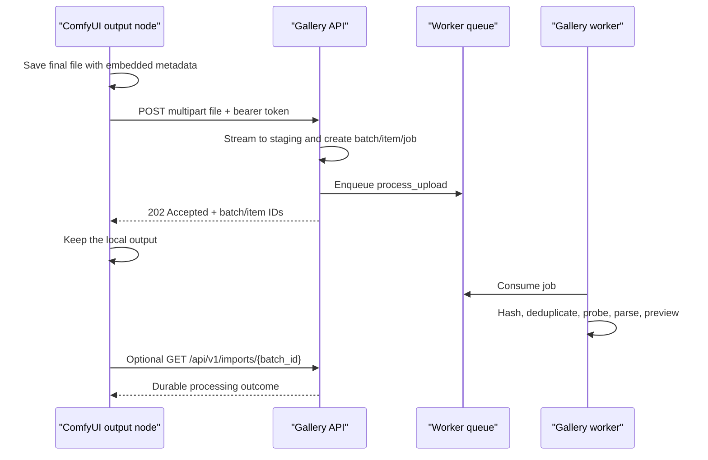

# ComfyUI Custom-Node Upload Integration

**Status:** Gallery server contract implemented; ComfyUI node package deferred

**Last verified:** 2026-08-05

**Gallery endpoint:** `POST /api/v1/media/imports`

## Purpose and boundary

This guide defines how a future ComfyUI output node sends a completed image or
video directly to ComfyGallery. The gallery already exposes the required generic
upload API. The custom node itself is not part of the MVP yet.

The node is a thin delivery client:

| Responsibility | ComfyUI node | ComfyGallery |
|---|---:|---:|
| Produce and save the final media | Yes | No |
| Preserve embedded prompt/workflow metadata | Yes | Stores exact bytes |
| Authenticate the request | Bearer token | Validates/revokes token |
| Stage, hash, deduplicate, and identify media | No | Yes |
| Parse workflow and model references | No | Worker pipeline |
| Generate previews/proxies | No | Worker pipeline |
| Retain import/job errors | Reads response | Yes |

Do not duplicate gallery parsing logic inside the node. Upload through the same
endpoint used by browser imports so direct generations, browser uploads, and NAS
scans converge on the same durable processing pipeline.

## End-to-end sequence



The `202 Accepted` response means the complete request body was staged and a
durable processing record was created. It does not mean parsing and preview
generation are complete.

## One-time gallery setup

1. Sign in to ComfyGallery as the administrator.
2. Open **API tokens**.
3. Create a token with a label such as `comfyui-output-node`.
4. Copy the token immediately; the plaintext value is shown only once.
5. Store it as a ComfyUI process secret, not as a workflow widget.

Recommended environment variables:

```dotenv
COMFY_GALLERY_URL=http://192.168.50.68:8181
COMFY_GALLERY_TOKEN=<paste-the-token-here>
```

Never put the token in a normal ComfyUI node input. Widget values are normally
part of the serialized workflow and may be embedded in generated files. Do not log
the token or include it in node result metadata.

Plain HTTP exposes both the token and private media to devices that can observe the
LAN traffic. Use HTTPS through a trusted reverse proxy if the network is not fully
controlled.

## Connectivity checks

The public health endpoint does not require authentication:

```bash
curl --fail --show-error \
  "${COMFY_GALLERY_URL}/health/live"
```

Then verify bearer authentication:

```bash
curl --fail --show-error \
  -H "Authorization: Bearer ${COMFY_GALLERY_TOKEN}" \
  "${COMFY_GALLERY_URL}/api/v1/imports?limit=1"
```

## Upload request

Send `multipart/form-data` with one or more repeated `files` fields:

```bash
curl --fail-with-body --show-error \
  -H "Authorization: Bearer ${COMFY_GALLERY_TOKEN}" \
  -F "files=@/absolute/path/to/final.png" \
  "${COMFY_GALLERY_URL}/api/v1/media/imports"
```

Contract:

- Authentication: `Authorization: Bearer <token>`.
- Body: multipart form with repeated field name `files`.
- Result: HTTP `202 Accepted` and an upload-batch document.
- Maximum: 200 files per request.
- Per-file limit: `CG_MAX_UPLOAD_BYTES`, 128 MiB by default.
- Supported MVP files: PNG, JPEG, WebP, MP4, and WebM.
- Trace response: the gallery returns `X-Request-ID`; retain it with any error.
- Do not send a browser CSRF token when using bearer authentication.

Typical response:

```json
{
  "id": "019f...",
  "status_url": "/api/v1/imports/019f...",
  "status": "processing",
  "total_count": 1,
  "queued_count": 1,
  "completed_count": 0,
  "duplicate_count": 0,
  "failed_count": 0,
  "created_at": "2026-07-25T08:00:00Z",
  "completed_at": null,
  "items": [
    {
      "id": "019f...",
      "batch_id": "019f...",
      "media_id": null,
      "media_url": null,
      "variant_import_url": null,
      "original_filename": "ComfyUI_00001_.png",
      "byte_size": 5242880,
      "status": "queued",
      "error_code": null,
      "error_message": null,
      "created_at": "2026-07-25T08:00:00Z",
      "completed_at": null
    }
  ]
}
```

The top-level `id` is an import-batch ID, not a media ID. `status_url` makes that
distinction explicit. The exact status returned immediately can advance while the
response is prepared. Client code must treat status strings as workflow state, not
assume the example is the only possible initial value.

## Polling a durable result

Polling is optional for fire-and-forget uploads and required when the client needs
the resulting media ID, including when it will attach a spatial-video variant.
Poll the returned `status_url`:

```text
GET /api/v1/imports/{batch_id}
Authorization: Bearer <token>
```

Batch terminal states:

- `completed`
- `completed_with_errors`

Item terminal states:

- `completed` — new content finished processing.
- `duplicate` — identical bytes already existed; `media_id` identifies the
  existing gallery record.
- `failed` — inspect `error_code` and `error_message`.

For `completed` and `duplicate`, the item also returns:

```json
{
  "media_id": "019f...",
  "media_url": "/api/v1/media/019f...",
  "variant_import_url": "/api/v1/media/019f.../variant-imports"
}
```

To attach a spatial-video variant after importing its original video:

1. Poll `status_url` until the matching item is `completed` or `duplicate`.
2. Fetch `media_url` and read its `sha256`.
3. Submit the spatial file to `variant_import_url` with that SHA-256 as
   `source_asset_sha256` and a stable `Idempotency-Key`.
4. Poll the returned variant/job projection separately until validation completes.

Do not use the upload-item `id` or batch `id` as a media ID.

Use a modest interval such as two seconds and a bounded wait. A polling timeout
must not turn an accepted upload into a failure or delete the local file.

## Minimal Python transport helper

The node should pass a known file path returned by its own save operation. It must
not search the output directory for the “newest” file because concurrent ComfyUI
queues can race.

```python
from pathlib import Path
import requests


def upload_to_gallery(
    saved_path: Path,
    *,
    gallery_url: str,
    token: str,
) -> dict:
    headers = {"Authorization": f"Bearer {token}"}
    with saved_path.open("rb") as media:
        response = requests.post(
            f"{gallery_url.rstrip('/')}/api/v1/media/imports",
            headers=headers,
            files={"files": (saved_path.name, media, "application/octet-stream")},
            timeout=(5, 300),
        )
    response.raise_for_status()
    return response.json()
```

This helper intentionally streams from a file handle instead of reading the whole
media into memory.

## Preserving the embedded workflow

The uploaded bytes are ComfyGallery's ground truth. The node must therefore upload
the exact final file produced by ComfyUI:

- Do not decode and re-encode an image before upload.
- Do not construct a new PNG from pixels after ComfyUI writes metadata.
- Do not transcode a video solely for gallery upload.
- Do not upload a thumbnail or preview in place of the original.
- Save locally first and keep that output when upload or polling fails.

For a classic ComfyUI V1 image output node, request the hidden `PROMPT` and
`EXTRA_PNGINFO` inputs and use them when saving:

```python
class SaveAndUploadGallery:
    OUTPUT_NODE = True
    RETURN_TYPES = ()
    FUNCTION = "save_and_upload"
    CATEGORY = "image/gallery"

    @classmethod
    def INPUT_TYPES(cls):
        return {
            "required": {"images": ("IMAGE",)},
            "hidden": {
                "prompt": "PROMPT",
                "extra_pnginfo": "EXTRA_PNGINFO",
            },
        }
```

The save implementation should follow ComfyUI's own `SaveImage` behavior before
calling the transport helper. ComfyUI documents that `EXTRA_PNGINFO` is copied to
PNG metadata unless metadata output is disabled. If ComfyUI is launched with
metadata disabled, no client can reconstruct missing embedded workflow evidence
from the final file.

For a V3 output node, use ComfyUI's output-node/save helpers and pass the node class
where required so prompt and extra information are embedded automatically. Do not
hand-roll a partial metadata format.

For video, integrate after the compose/save node has finalized and closed the actual
MP4 or WebM. Pass that exact path to the uploader. A node that receives only an
in-memory image tensor cannot promise preservation of video-container metadata.

References:

- [ComfyUI hidden inputs and PNG metadata](https://docs.comfy.org/custom-nodes/backend/more_on_inputs)
- [ComfyUI V3 output-node migration](https://docs.comfy.org/custom-nodes/v3_migration)
- [ComfyUI output-node execution behavior](https://docs.comfy.org/custom-nodes/backend/server_overview)

## Failure and retry policy

Retry only the transport operation, always with the same saved bytes.

- Retry connection failures, `429`, `502`, `503`, and `504` with bounded
  exponential backoff and jitter.
- Do not automatically retry `401`; the token or URL needs correction.
- Do not retry `413`; increase the configured limit deliberately or reduce the
  source file.
- Do not retry `422` without fixing the request.
- A retry can create another upload-batch audit record. Exact SHA-256
  deduplication prevents another managed-media record for identical bytes.
- Processing may fail after the HTTP response. Poll the batch, or let the user
  inspect Imports/Jobs in the gallery.

API errors use the standard envelope:

```json
{
  "error": {
    "code": "UPLOAD_TOO_LARGE",
    "message": "The uploaded file exceeds the configured size limit.",
    "details": {},
    "request_id": "6ed0f1ee-..."
  }
}
```

Surface the code, message, and request ID in the ComfyUI UI. Do not print the
authorization header.

## Recommended node behavior

The eventual package should provide one combined save-and-upload output node for
images and an upload-after-save path for video:

1. Save the final file locally with ComfyUI metadata.
2. Close and flush the file.
3. Upload that exact path.
4. On `202`, report “accepted” with the batch ID.
5. Optionally poll to a terminal state.
6. Preserve the local file regardless of network or gallery processing outcome.
7. Never auto-delete or rewrite a generated file.

Useful node controls are limited to gallery URL, upload enabled, wait-for-result,
and result timeout. The token belongs in process configuration, not the workflow.

## Acceptance checklist for the future node

- A PNG imported through the node exposes the same raw prompt/workflow evidence as
  the local saved PNG.
- An MP4/WebM is byte-identical to the local saved output.
- Duplicate delivery returns the existing `media_id` without a second media record.
- Invalid/revoked token, unavailable gallery, oversized media, and asynchronous
  parse failure are distinguishable to the user.
- Two concurrent queues never upload one another's files.
- The bearer token is absent from workflow JSON, embedded metadata, logs, and node
  outputs.
- ComfyUI remains successful and the local media remains present when the gallery is
  offline.
