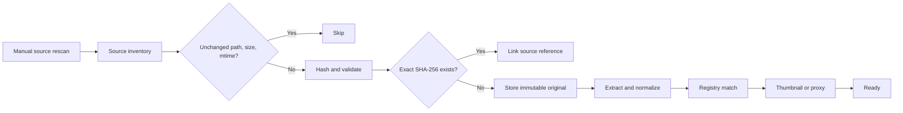
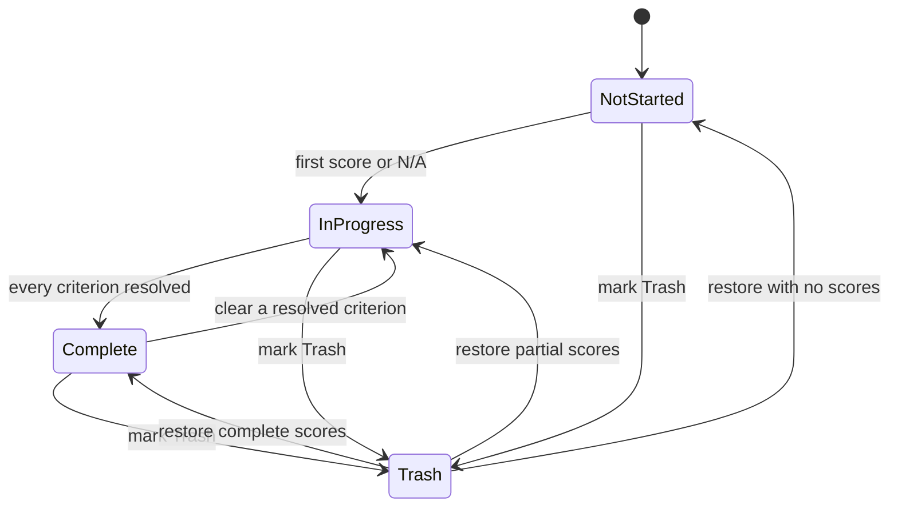

# User Workflows

**Status:** Accepted

## 1. First deployment

1. Configure Docker volumes for managed media, import roots, PostgreSQL data, and backups.
2. Start the Compose stack.
3. Create the single administrator login.
4. Configure the current LoRA Manager/ComfyUI base URL if available.
5. Run initial node-schema and model-registry synchronization.
6. Review synchronization stages; Civitai misses are informational rather than fatal.

## 2. Bulk NAS import

1. Register an allowed NAS import root.
2. Trigger a scan.
3. The source inventory discovers new or changed paths.
4. Unchanged paths are skipped; candidates are hashed.
5. Exact duplicates link to the existing media record.
6. New files enter the durable processing pipeline.
7. The gallery becomes usable progressively while the remaining batch continues.
8. Failed items remain filterable with stage-specific errors and retry actions.

## 3. Browse and manage

The user can:

- Switch between virtualized gallery and record table.
- Filter by media type, source folder, readiness, evaluation state, Trash, checkpoint, LoRA, architecture, pipeline pattern, tags, or errors.
- Inspect media, original prompt/workflow metadata, normalized nodes, semantic observations, model usages, and provenance.
- Add media to static collections or apply tags.
- Save the current filter as a dynamic reusable view.
- Open the original or download it instead of a proxy.

## 4. Correct parser knowledge

1. Open the unknown-node inbox, ordered by affected media count.
2. Inspect example nodes, raw input values, graph connections, and automatic evidence.
3. Tag an input as checkpoint, LoRA, prompt, sampler configuration, or another supported semantic type.
4. Preview the workflows affected.
5. Save the versioned correction.
6. The worker reprocesses affected workflow snapshots.
7. Raw embedded metadata remains unchanged.

High-confidence automated classifications are already active. The inbox should concentrate manual work on ambiguous or high-impact cases.

## 5. Synchronize the model registry

1. Trigger registry synchronization.
2. LoRA and checkpoint scans run independently.
3. Bulk Civitai fetches are attempted.
4. Latest LoRA Manager lists and metadata are imported.
5. The UI reports scan, enrichment, and import stages independently.
6. Local-only models with no Civitai match remain healthy resolved records.
7. Historical workflow-only references remain searchable even when the file is gone.

## 6. Start a review session

The user may start from:

- Random eligible media.
- Individually selected media.
- A source folder.
- A static collection.
- A saved filter.
- The current unsaved filter.

Starting creates a lightweight snapshot of candidate IDs, ordering, position, and applicable rubric modules. It does not create an obligation to finish.

## 7. Evaluate media

The review screen shows:

- Large image viewer or video player on the left.
- Exact prompt fields and applicable criteria on the right.
- No checkpoint, LoRA, workflow configuration, or experiment metadata.

For each criterion:

- Click or drag to set an integer from 0 through 10.
- Use the clear action or Delete/Backspace to return to unset.
- Select N/A when the criterion cannot be judged.
- Consult the 0/5/10 anchor tooltip.

Scores autosave on committed changes. Completing every applicable criterion changes the state to Complete, but does not navigate automatically. Next is always explicit.

## 8. Resume later

The user may close the browser or stop at any point. On returning:

- The global In progress pool proposes partially evaluated media, most recent first.
- A review session can resume from its saved position.
- The user may ignore, abandon, or delete a session without affecting saved evaluations.

## 9. Run an analysis

1. Filter to the population of interest, typically within an architecture and pipeline pattern.
2. Choose a model-focused report.
3. Select criteria or a composite weighting profile.
4. Inspect sample counts, distributions, uncertainty, coverage, and co-occurring models.
5. Save the result to freeze exact media and score revisions.
6. Later, rerun with current data to create a new version without changing the original result.

The report uses language such as “associated with” and “shows a tendency.” It does not declare an intrinsic or universal winner.
